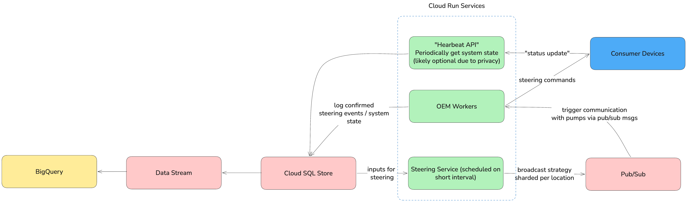

# Podero Write-Up

## Open Questions

- How many customers / devices do we have? 
- Optimization for electricity price vs "heating" price (take heat pump efficiency into account)
- We never have direct "control" over the pumps, rather "steering cues" (within user-set margins)?

## Current approach challenges

### Technology

- Scheduler based on Celery - likely means we need to "operate" it: DevSecOps support, updates, own infra (even if IaaS via hyperscaler).
    - Additionally, it can be flaky (at least once delivery, no guaranteed in-order execution without chaining, etc)
    - Likely quite hard to scale to the intra-day / dynamic steering approach
- Lacking monitoring if the command to the pump was processed & how it affected real-world system - so we lack a feedback loop to train our trading/predictive models.
- It seems like some of the commands may be not idempotent (in the docu we have "e.g. for min→ max "Change heating temperature offset by 1 degree") -> this likely will cause issues / efficiency loss with any case of more-than-once delivery (network issues, wrong error handling in the OEM API, race condition in our back-end infra taking the same task twice)
- We overall don't take the current state of the sysyem into account for steering - maybe this can be used for our & users' benefit. If we can model at least minimal thermal capacity of target system we can drive heat pumps a lot more "aware".
- In cases of min->max->min->max steering inputs we may run a lot of heat-cool cycles reducing user comfort & efficiency -- it can be beneficial to smooth-out commands over the period of time.
- Our "generic" (min, max) commands are a very "weak" contract. We should evaluate our OEM providers to understand their capabilities better - then we can tailor not just OEM APIs, but also the steering algorithm.

### "Logical" & business

- There are several ways to improve econonical efficiency of our steering. Overall, let's aim to reduce total cost, not just the price we consume at (so, e.g. "a lot of energy at low price" is usually worse than "a bit of energy at a higher price point"). Then, we have several considerations:
    - We don't take COP of heat pumps in any given moment - so, for example, if it's cold outside during the short night period, our cheap energy prices can be negated by lower COP of the heating unit -> hence spending more on energy (even if it's technicall the cheapest). 

    - Algorithm right now only takes current energy price into account, without any look-ahead. This leads into greedy approach where we may either "over-consume" before a long period of also cheap energy, or don't pre-heat environment when the price is "average" with "high" price ahead.

    - Additionally we need to consider the comfort / "quiet" hours and so on, which we can do during a deep dive.

- We don't "personalize" our commands per heating pump now - only per "energy price". We can collect the data on how effective our steering was in achieving a given set-point over time and use this to start heating cycle earlier/later - thus avoiding a spike in consumption when actual temperature goes into a limit and causes "oh no, max heat right now" behavior.

## Options to improve

One approach to the new architecture is to center our system around Google Cloud Run & Pub/Sub service. On the diagram below we can see what it can look like.

In principle, we need to:
- enable feedback look from end-user systems
- enable look-ahead for our algorithm
- allow for more granular idempotent steering commands
- make sure that whatever data we collect is available for analysis and fine-tuning of our strategies

So, we will use Cloud Run to schedule our main "Steering Service" (names are hard, and it's not really a service when it's a smart dockerized cron job, but here we are) - it will consume current pricing information, as well as predicted spot pricing to generate steering commands. These commands need to be idempotent (so, e.g. not "reduce offset by 1 degree", but rather "set offset to the user input - 1 degree"), but otherwise they will need to be fine tuned during a more in-depth session. For now, let's focus on the big picture.

The steering commands should be sharded on per-region basis to avoid individual steering unless needed for algo (e.g. if we model thermal capacity for each customer). Once a command is issued, it is available via the Pub/Sub to OEM Workers (each knows how to talk to one brand / device) and sent out to the devices via OEM API. For this we would also use Pub/Sub-triggered Cloud Run instances - mainly for the simplicity & homogeneous architecture, as the pricing would be tolerable -> we pay for compute & ram, so with proper batching (hence our sharding and not individual steering) we will have a limited number of OEM Workers spinning up. Realistically, we will still have some errors in the processing, but Dead Letter Queue with API back-off pattern would be sufficient for the first iteration.

Once the commands are sent out, we need to record not just the "POST request is done", but how it affected the system (house heating). I am not sure if we already have some telemetry going to us, let's assume that it's possible - in such case, our telemetry needs to be fed back into the Steering Service's database - to correct deviations from set-points before it's too late.  This allows our Steering Service to compute difference between desired and actual state - and issue commands to minimize it, instead of just relying on price/efficiency predictions.

On the other hand all the telemetry, commands, and "heating cost" should be made avaiable for analysis. As a low hanging fruit (not huge amounts of data or dimensions) we can use a stack of BigQuery + Data Flow to expose this analytical dataset.

In this approach we mostly rely on GCP to do our heavy-lifting (of course, there are similar services on other hyperscalers, so we still can migrate out). In terms of specific frameworks and languages, pretty much anything that is testable would work. Without a strong need, we don't need to invent complex data pipelines, so the tech of choice would be the one which is familiar to the team and can give us speed & confidence.

## Main tradeoffs

### GCP Pub/Sub + Cloud Run vs Celery

Any cloud infra involves a degree of vendor locking & loosing flexibility. In our case though we don't need as much "operational effort" with cloud-based managed services as we would when managing Celery ourselves - which usually outweighs a potential migration effort.

Additionally, with most cloud services, GCP included, we "pay as we go" and can't usually have a "constant cost" for infra. Howeve, with the nature of our business - relatively low number of customers and ability to precict customer growth relatively well (and stable load-per-customer), cloud costs should still remain fairly predictable and transparent.

### Privacy

Some users will find sending telemetry to us distrubing, so we need to have an back-up / reduced algorithm solution. Perhaps, rely only on price + freely available information (e.g. weather) + geo-referencing IPs. It will yield lower results, but we will be able to also market our approach as non-invasive - can be useful in current environment.

### Algorithm changes & performance monitoring

I did not consider an in-depth approach to back-test steering algorithm. However, here are a few thoughts:
- Likely, we can approximate users' behavior with a simulation, but any sort of real user testing (e.g. A/B testing) will be quite length, as people have their weekly/montly patterns of consumption.
- If we have thermal capacity model for our consumers we can "replay" past days with various steering strategies
- We can use the log of our commands and telemetry data for training with essentially closed feedback loop, as we constantly get new live data.

### Edge cases in need of further investigation

- unreliable price info -> need to have a back-up plan when price prediction fails. Maybe, optimize for total "energy used" regardless of price then.
- we need to ensure safe system operation -> each device may have its own freeze protection regime / etc
- some OEMs may have API restrictiojns / rate limits
- some devices (albeit quite unusual today) may have wrong clock times set